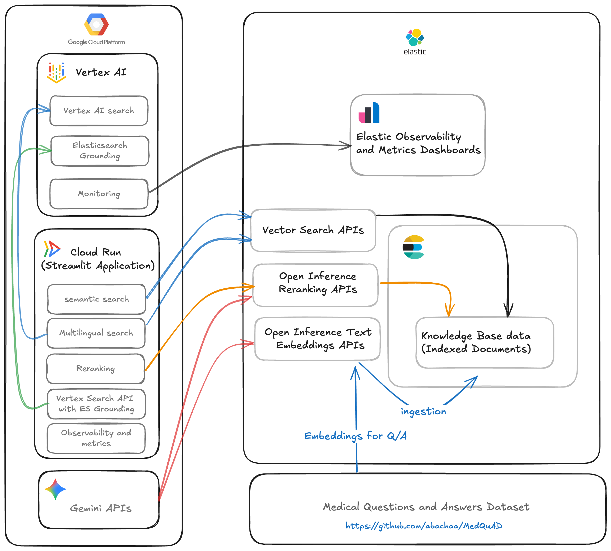

# elastic-gcp-ai-accelerate
Code base for the AI Accelerate elasticsearch and GCP hackathon

## Inspiration
We noticed that while AI models are increasingly used for healthcare Q&A, they often hallucinate or provide inaccurate medical information. Patients and developers need a trusted, verified source of medical knowledge. Elastic HealthCare was inspired by the need for reliable, doctor-verified answers delivered quickly and efficiently using AI and advanced search technologies.

## What it does
* Ask medical questions and receive verified answers from doctors.
* Search through a curated dataset of medical Q&A and documents.
* Get AI-assisted insights powered by Vertex AI while ensuring factual accuracy.
* Quickly find relevant information using Elasticsearch-powered fast search.
*  Present answers in a clear, structured, and interactive UI, including supporting references and grounding documents.

## Architecture

## How we built it
* Backend: Python, Elasticsearch for storing and searching medical documents, Vertex AI for AI-assisted grounding.
* Frontend: Streamlit for interactive, user-friendly pages.
* Data: Curated medical datasets, Q&A pairs, and verified references.
* Integration: Vertex AI embeddings used to semantically match questions with answers, Elasticsearch reranking for relevance, and embedding search for grounding.
* Deployment: Hosted with GCP Cloud Run, Elasticsearch, and cloud-based Vertex AI services

## Challenges we ran into
* Search relevance: Tuning Elasticsearch and Vertex AI embeddings to return the most accurate answers.
* Performance: Keeping response times low while performing semantic searches and reranking.

## Accomplishments that we're proud of
* Built a fully functional AI-assisted healthcare search platform.
* Successfully integrated doctor-verified data with Vertex AI embeddings and Elasticsearch search.
* Implemented relevance reranking and grounding for higher accuracy.
* Created a polished UI in Streamlit, with features like suggested questions, multilingual support, and easy-to-copy answers.
* Ensured answers are trustworthy and traceable, reducing the risk of misinformation.

## What we learned
* The importance of grounding AI responses to verified sources to maintain trust.
* How to combine search engines and AI embeddings effectively for healthcare applications.
* Strategies for optimizing indexing and reranking of large document sets.
* Best practices for Streamlit app design to create interactive, user-friendly dashboards.

## What's next for Elastic HealthCare – Verified Medical Responses
* Integrate more verified datasets from trusted medical sources.
* Improve AI grounding and reranking to handle more complex queries.
* Explore personalized insights for healthcare professionals and patients.

